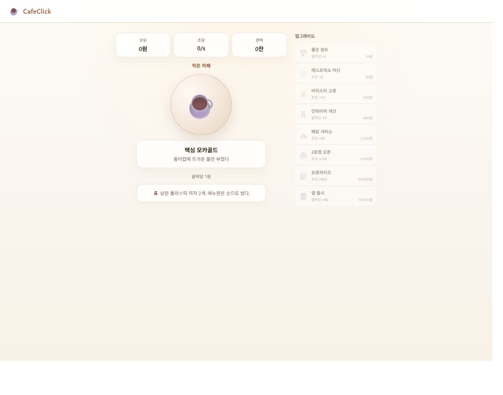
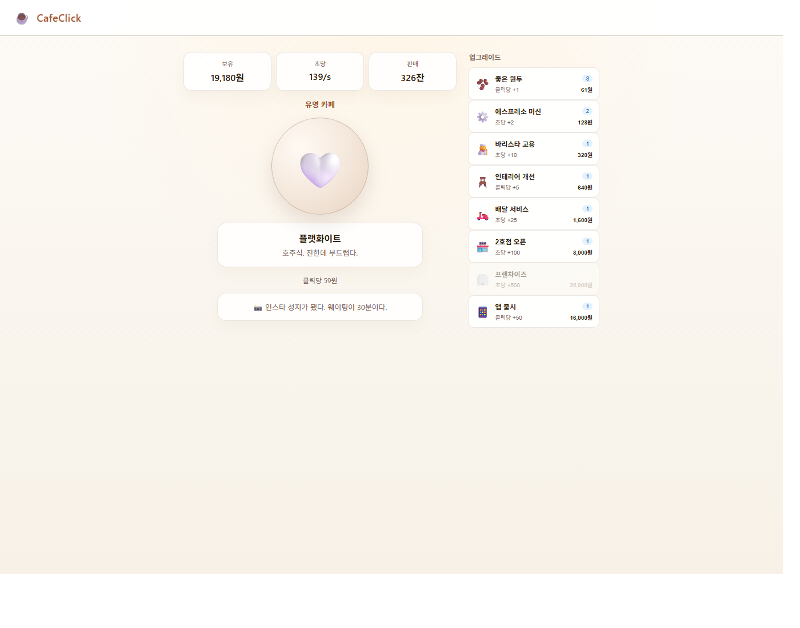
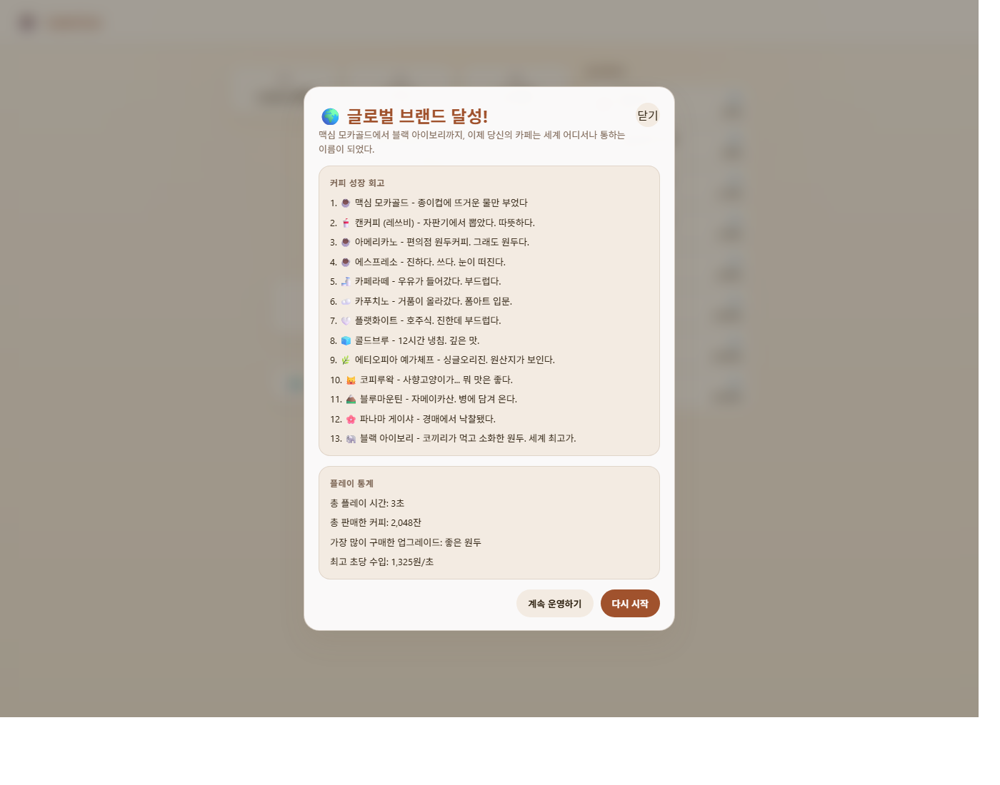

# CafeClick

CafeClick은 숫자만 커지는 클리커가 아니라, 작은 카페가 점점 더 그럴듯한 브랜드로 성장하는 감각을 보여주는 단일 파일 방치형 게임이다. 커피 단계가 바뀌고, 카페의 분위기 묘사가 달라지고, 마지막에는 글로벌 브랜드 엔딩 화면까지 이어진다.

## 플레이 방법

1. 가운데 커피 버튼을 눌러 돈을 번다.
2. 오른쪽 업그레이드를 구매해 클릭 수입과 자동 수입을 키운다.
3. 누적 수입이 오를수록 커피와 카페 상태가 함께 진화한다.
4. 진행 상황은 자동 저장되며, 누적 수입 1,000,000원에 도달하면 엔딩 화면이 열린다.

## 핵심 기능

- `total` 기준으로 13단계 커피 진화
- 마일스톤별 카페 상태 묘사 변화
- 업그레이드 첫 구매 전용 토스트 문구
- `localStorage` 자동 저장과 불러오기
- 최고 초당 수입, 플레이 시간, 판매 잔 수를 보여주는 엔딩 오버레이
- 클릭 수입 크기에 따라 달라지는 파티클과 100번째 클릭마다 터지는 커피 버스트

## 커피 진화 미리보기

| 누적 수입 | 커피 | 한 줄 묘사 |
| --- | --- | --- |
| 0 | 맥심 모카골드 | 종이컵에 뜨거운 물만 부었다 |
| 50 | 캔커피 (레쓰비) | 자판기에서 뽑았다. 따뜻하다. |
| 200 | 아메리카노 | 편의점 원두커피. 그래도 원두다. |
| 600 | 에스프레소 | 진하다. 쓰다. 눈이 떠진다. |
| 1,500 | 카페라떼 | 우유가 들어갔다. 부드럽다. |

이후 단계는 직접 플레이하면서 확인할 수 있다.

## 스크린샷

### 초기 상태



### 업그레이드 후 상태



### 엔딩 화면



## 실행 방법

정적 페이지라서 설치 과정이 없다.

```bash
start index.html
```

로컬 서버가 필요하면 다음 명령으로 충분하다.

```bash
python -m http.server 5500
```

브라우저에서 `http://127.0.0.1:5500`으로 열면 된다.

## 테스트

```bash
node tests/cafe-clicker.test.js
```

## 테스트 환경 구축 방식

테스트는 `tests/cafe-clicker.test.js` 하나로 구성되어 있고, 브라우저 대신 Node.js의 `vm` 모듈에서 `index.html` 안의 인라인 스크립트를 실행한다. 여기에 작은 가짜 DOM과 가짜 `localStorage`를 붙여서 초기 렌더, 커피 진화, 업그레이드 구매, 자동 저장, 엔딩 화면, 클릭 연출까지 회귀 검증한다. 외부 테스트 러너 없이도 정적 프로젝트에 맞는 빠른 자동 검증이 가능하도록 만든 방식이다.

## 왜 외부 라이브러리 없이 만들었는가

이 프로젝트는 단일 파일 안에서 UI, 스타일, 게임 루프를 끝까지 제어하는 연습에 가깝다. 그래서 프레임워크를 넣기보다 HTML, CSS, JavaScript만으로 상태 흐름과 렌더링을 직접 다루는 쪽이 게임의 성장 연출을 더 또렷하게 보여준다. 배포도 단순한 정적 호스팅으로 끝나서 구조가 가볍고, 테스트 역시 현재 파일 하나만 기준으로 빠르게 돌릴 수 있다.

## 배포

- 정적 배포 설정은 [`vercel.json`](vercel.json)에 들어 있다.
- 배포 명령은 `npx vercel --prod --yes`이다.
- 배포 링크는 이번 작업 중 생성하지 못했다. 현재 세션에서 Vercel 인증 토큰이 유효하지 않아 실제 배포가 실패했다.

## 파일 구성

```text
cafe-clicker/
├─ docs/
│  └─ screenshots/
├─ index.html
├─ tests/
│  └─ cafe-clicker.test.js
├─ vercel.json
└─ README.md
```

## 라이선스

MIT
